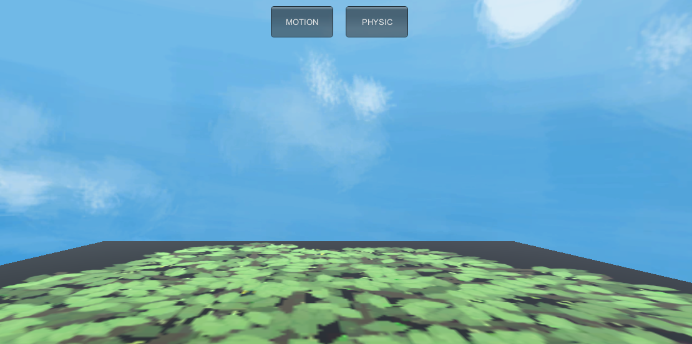
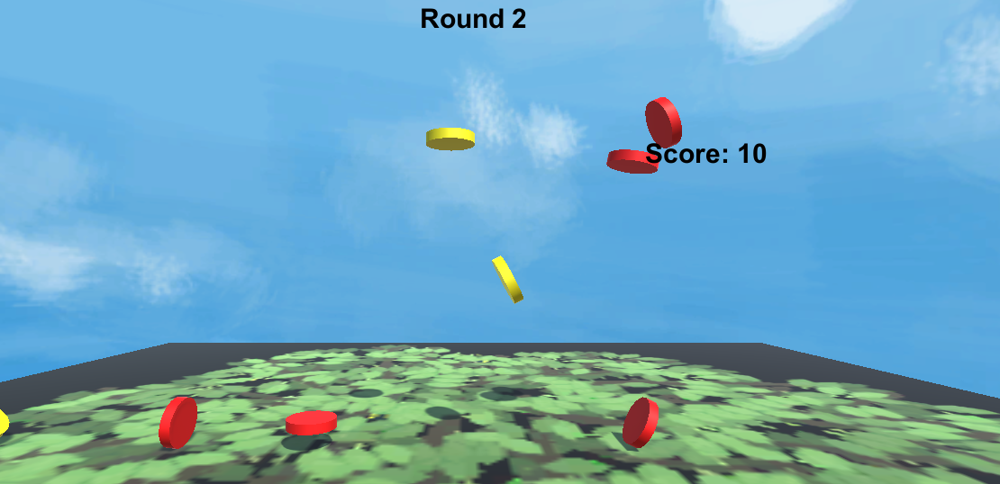

[TOC]

# 五、物理系统与碰撞

## 1、改进飞碟（Hit UFO）游戏：

- 游戏内容要求：
  1. 按 *adapter模式* 设计图修改飞碟游戏
  2. 使它同时支持物理运动与运动学（变换）运动


在UserGUI中添加选择按钮，并在场记中添加记录游戏模式的变量。根据选择执行不同的动作管理器，一种是支持物理引擎的PhsicActionManager，一种是之前的简单动作管理器。



部分修改场记代码：

两个动作管理器实现IACtionManager的接口。

```c#
public enum ActionMode { PHYSIC, KINEMATIC, NOTSET }  

public IActionManager actionManager { get; set; }  //动作管理器

public ActionMode mode { get; set; }

//根据选择添加不同的场记
public void setMode(ActionMode am){
		Debug.Log (am);
		if (am == ActionMode.KINEMATIC)  {  
			this.gameObject.AddComponent<SSActionManager>();  
		}  
		else  {  
			this.gameObject.AddComponent<PhysisActionManager>();  
		}  
		mode = am;
	}
```


IActionManager的接口：

```java
public interface IActionManager {  
	void StartThrow(GameObject disk);  
	int getDiskNumber();  
	void setDiskNumber(int num);  
}  
```


CCMoveToActions的改进：

添加FixedUpdate实现物理效果

```c#
public override void Start () {  
		enable = true;  
		gravity = 9.8f;  
		time = 0;  
		horizonSpeed = gameobject.GetComponent<DiskData>().speed;  
		direction = gameobject.GetComponent<DiskData>().direction;  
		rigidbody = this.gameobject.GetComponent<Rigidbody> ();

		//如果使用了物理模式的刚体，则设置。
		if (rigidbody) {
			rigidbody.velocity = horizonSpeed * direction;
		}
	}  

//物理模式下的运动
public override void FixedUpdate(){
		if (gameobject.activeSelf) {
			if (this.transform.position.y < -3) {
				this.destory = true;
				this.enable = false;
				this.callback.SSActionEvent (this);
			}
		}
	}
```


物理效果图：

